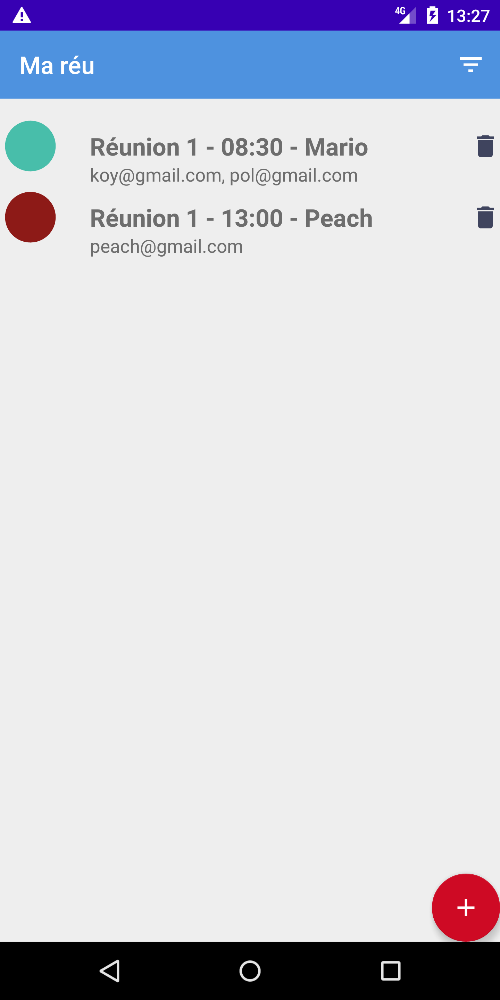
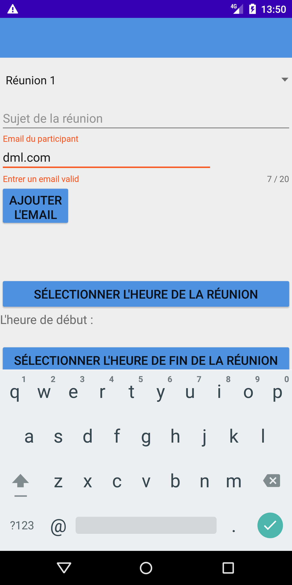

# Maréu Application du projet 4 OpenClassrooms
--------------------

Cette application réalisée à partir d'un projet vierge est un POC(Proof of concept) la persistance des données n'est donc pas gérée. 
L'objectif était à terme une meilleure gestion des réunions dans "L'entreprise".

Les fonctionnalités développées :

* L'écran principal qui affiche la liste des réunions.
* Un filtre par date.
* Un filtre par lieu.
* Affichage de l'ajout et de la liste simultanément sur tablette.

Au clic sur le bouton d'ajout un écran avec:

* Tous le nécessaire pour créer une réunion voire screen si-dessous.
* Le code ne permettant pas de créer une réunion dans la même salle et sur le créneau horaire d'une autre.
* Le champ email utilise un Pattern "EMAIL_ADDRESS" pour éviter les erreurs côté utilisateur.

L'ensemble des tests unitaires et instrumentalisés ont été réalisés .

## Phone display

&ensp;

## Filtre par date & lieu

&ensp;

## Tablet display:

### App Architecture

* Java

### Library

* ButterKnife
* Espresso

1 ->Press "clone or download"
2 -> Download zip
3 -> Unzip 
4 -> Open repository "Projet-4-Partage-master " with Android Studio
5 -> Wait Android Studio auto build or build
6 -> Run on AVD (min21/max29)
